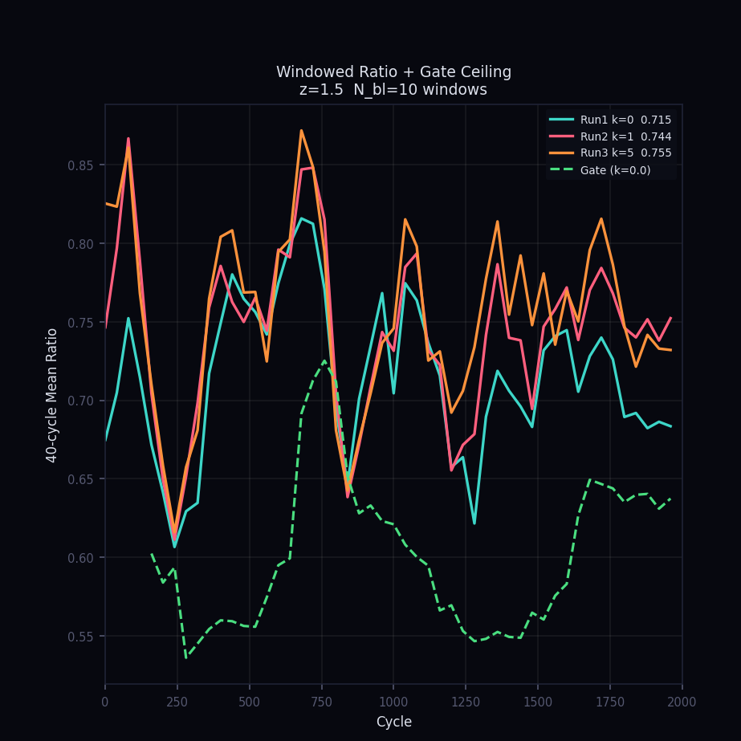
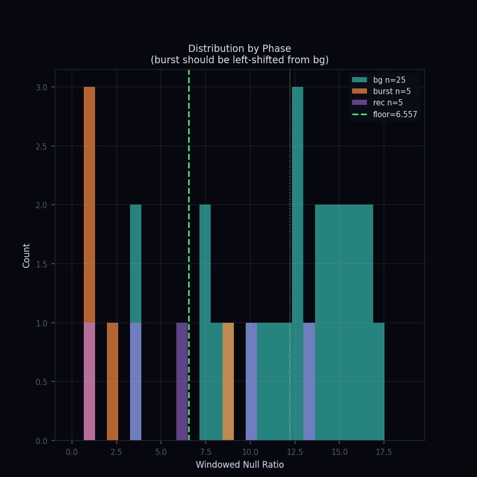

# Sixthxz

*Sleepwalking through blackouts, lost in a dreamlike state*

---

*I work across theoretical and applied systems — from information thermodynamics to adaptive estimation architectures — exploring how feedback, constraint, and information flow shape behavior under noise.*

---

> This isn't about physics. It isn't about metaphysics either.
> It's a map — drawn by someone who followed an obsession long enough to discover what the obsession was actually about.
> The equations are real. The simulations run. But what they were always tracing was something interior:
> a structural pattern that appeared early and kept reappearing in every language I tried.
> Physics was simply the first language rigorous enough to hold it without distortion.
> You don't need the math to recognize the shape.

---

## An attempt to translate my thoughts into a right language

---

### Timeline & Records

-   **2024-10-02** — The expansion of the observable universe, limited by the speed of light but also shaped by the ability to acquire, model, and structure information.
-   **2025-04-19** — Extended Perceptual Quantum Equation (REC Version)
-   **2026-02-17** — Formalization of the SFE-01 Information Motor (v4.1). Defined the average work per cycle ($W_{cycle}$) extractable from a controlled sinusoidal drive using mutual information ( $\mathcal{I}(\rho)$ ) under a resonant oscillator with damping and environmental decoherence ($\gamma_{env}$).
-   **2026-02-19** — Numerical Validation and Langevin Dynamics Study (v4.1.2). Confirmed peak work extraction $W_{max} \approx 1.42 \times 10^{-22}$ J at resonance. Efficiency ≈ 5% of the Landauer limit.
-   **2026-02-20** — Scaled Simulation & Phase Feedback Study (v5.0). Implemented full complex susceptibility $|\chi(\Omega)|^2$ and bang-bang phase feedback. Peak efficiency: **7.85% of Landauer limit**. +17% work lift over open-loop.
-   **2026-02-23** — SFE-05.12b / 05.13b — Innovation Floor-Lock & Architectural Resolution.

---

## SFE-05.12b / 05.13b — The Floor-Lock Result

### The Problem
An adaptive agent tracks a stochastic field using a matched Kalman estimator. Detection failed not because of noise or tuning, but because of architecture.

### The Structural Constraint (Floor-Lock)
When a matched estimator reaches steady state, predictable structure is absorbed into covariance. The residual becomes whitened. Regime contrast disappears.

**Estimation minimizes surprise. Detection requires preserving contrast.**

If detection depends on the same channel used for optimal prediction, prediction erases the very contrast detection requires. This is the **Estimation–Detection Coupling Principle**. When these goals share a signal path, detection collapses.

---

### Visual Validation

**1. The Lock (SFE-05.12b)**
The "Windowed Ratio" lines are tangled. Optimal prediction has absorbed the structure, leaving the detection gate blind to regime changes.

**2. The Resolution (SFE-05.13b)**
Architectural decoupling. By using a null predictor for detection and a Kalman for tracking, contrast is restored. The $3.02\sigma$ separation between background and burst is now visible.

---

### Structural Summary
Optimal prediction erases predictable structure. 
Architecture determines observability.

*This project remains open — not because it is incomplete, but because structural understanding evolves as systems become more adaptive.*