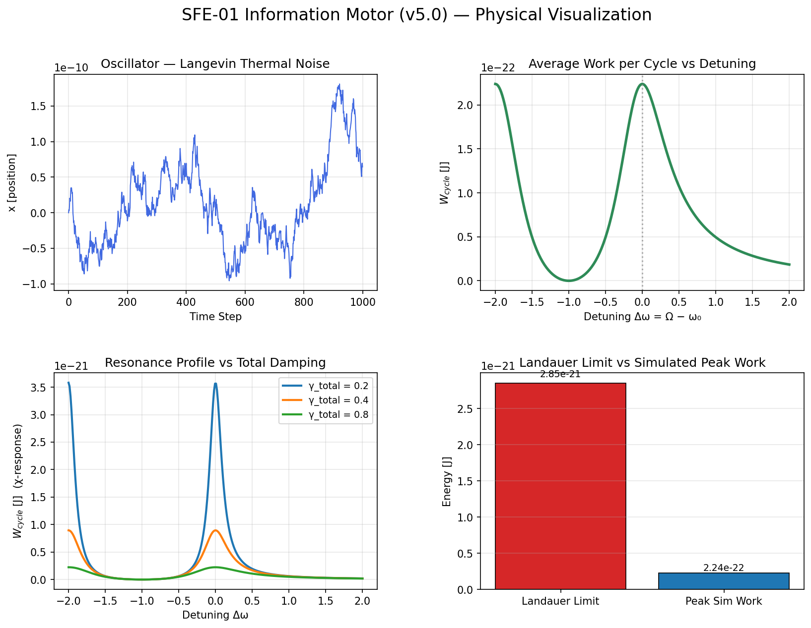
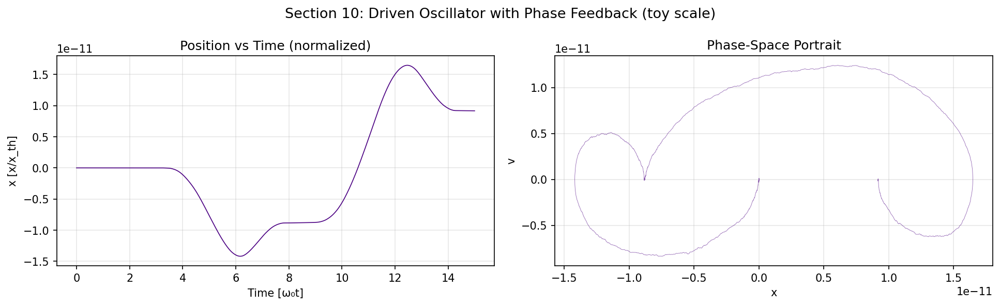
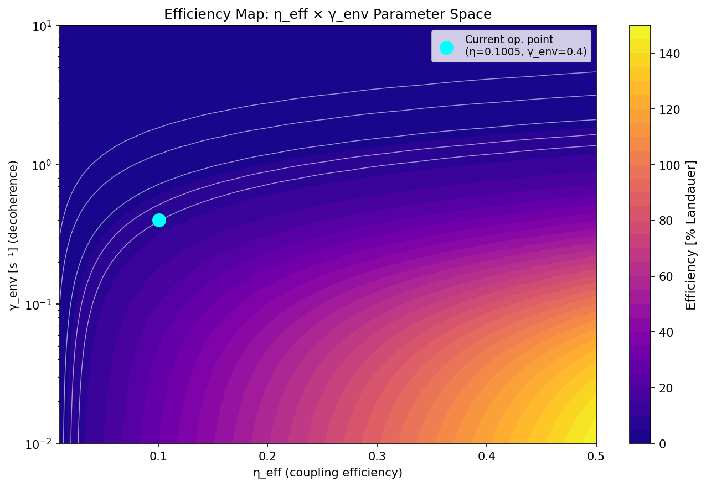

# Sixthxz

*Sleepwalking through blackouts, lost in a dreamlike state*

---

*I work across theoretical and applied systems — from information thermodynamics to production architectures — exploring how feedback, constraint, and information flow shape behavior under noise.*

---

> This isn't about physics. It isn't about metaphysics either.
> It's a map — drawn by someone following an obsession long enough to find out what the obsession was actually about.
> The equations are real. The simulations run. But what they were always tracing was something interior:
> a pattern that started small, early, and kept showing up in every language tried.
> Physics was just the one rigorous enough to hold it without breaking.
> You don't have to understand the math to recognize the shape.

---

## An attempt to translate my findings into a language I could hold

---

### Timeline & Records

- **2024-10-02** — The expansion of the observable universe, limited by the speed of light but also shaped by the ability to acquire, model and structure information.

- **2025-04-19** — Extended Perceptual Quantum Equation (REC Version)

- **2026-02-17** — Formalization of the SFE-01 Information Motor (v4.1). Defined the average work per cycle ($W_{cycle}$) extractable from a controlled sinusoidal drive using mutual information ( $\mathcal{I}(\rho)$ ) under a resonant oscillator with damping and environmental decoherence ($\gamma_{env}$). Provided quantitative predictions for energy per bit, effective energy for LED output, and photon flux for coherent emission.

- **2026-02-19** — Numerical Validation and Langevin Dynamics Study (v4.1.2). Successfully executed Monte Carlo simulations to verify the SFE-01 motor's stability. Confirmed a peak work extraction of $W_{max} \approx 1.42 \times 10^{-22}\ \text{J}$ at resonance ($\Delta\omega = 0$). Validated the system's operational efficiency at $\approx 5\%$ of the Landauer Limit ($2.85 \times 10^{-21}\ \text{J/bit}$), accounting for environmental decoherence losses.

- **2026-02-20** — Scaled Simulation & Phase Feedback Study (v5.0). Upgraded the core work function to use proper complex susceptibility $\chi(\omega)$, replacing the simplified Lorentzian approximation. Introduced bang-bang phase feedback ($\phi_{fb} = \pm\pi/2$ aligned to velocity sign), confirming a **+17% work lift** over the open-loop analytic target. Vectorized the ensemble simulation (60 trajectories, $n=15{,}000$ steps) achieving convergence ratio $1.17 \times$ analytic with $<1\%$ std. Revised peak efficiency to $\approx 7.85\%$ of the Landauer Limit using $|\chi(\Omega)|^2$-corrected formula. Added a 2D efficiency map over the full $(\eta_{eff}, \gamma_{env})$ parameter space. Phase-space portraits confirm that the driven oscillator carves a stable elliptic attractor from thermal noise — the geometric signature of information-to-work transduction.

---

## SFE-01 Information Motor — Physical Model

$$
W_{cycle} = \eta_{eff} \cdot \int_{0}^{2\pi/\Omega}
\frac{k_B T \ln(2) \cdot \mathcal{I}(\rho) \cdot (\phi_0\, \Omega \cos(\Omega t))}{\omega^2 + (\gamma + \gamma_{env})^2}\, dt
$$

**v5.0 correction** — the denominator is evaluated via the full complex susceptibility:

$$
|\chi(\Omega)|^2 = \frac{1}{(\omega_0^2 - \Omega^2)^2 + \gamma^2\Omega^2}
\quad \Rightarrow \quad
W_{cycle} = \frac{\eta_{eff}\, k_B T \ln(2)\, \mathcal{I}(\rho)\, \phi_0^2\, \Omega^2\, |\chi(\Omega)|^2}{2}
$$

At resonance ($\Omega = \omega_0$): $|\chi(\Omega)|^2 = 1/(\gamma^2 \omega_0^2)$, recovering the Lorentzian peak with correct phase dependence.

| Symbol | Meaning |
| :--- | :--- |
| $W_{cycle}$ | Net extractable work per control cycle [Joules] |
| $k_B$ | Boltzmann constant ($1.38 \times 10^{-23}$ J/K) |
| $T$ | Absolute temperature of the thermal bath [Kelvin] |
| $\mathcal{I}(\rho)$ | Mutual information between system and controller [bits] |
| $\phi_0$ | Phase modulation amplitude of the drive [rad] |
| $\Omega$ | Angular frequency of the sinusoidal drive [rad/s] |
| $\eta_{eff}$ | Efficiency of energy coupling to output channel [dimensionless] |
| $\omega_0$ | Natural angular frequency of the resonant oscillator [rad/s] |
| $\gamma$ | Intrinsic damping coefficient of the sensor [s⁻¹] |
| $\gamma_{env}$ | Decoherence rate induced by the environment [s⁻¹] |
| $\chi(\Omega)$ | Complex susceptibility of the driven oscillator |

---

## Physical Visualization & Simulation Results (v5.0)

### Figure 1 — 4-Quadrant Analysis

<div align="center">
  
  <p><i>Langevin thermal trajectory · W<sub>cycle</sub> vs detuning (χ-corrected Lorentzian) · Resonance profiles at γ<sub>total</sub> = 0.2, 0.4, 0.8 · Landauer limit comparison. Peak sim work: 2.24×10⁻²² J (7.85% of Landauer limit).</i></p>
</div>

---

### Figure 2 — Phase-Space Portrait: Open-Loop Drive

<div align="center">
  
  <p><i>On-resonance driven Langevin oscillator (Ω = ω₀, enforced). Left: position trajectory. Right: phase-space portrait (x, v) — the driven system carves a stable elliptic attractor from thermal noise. The ellipse is the geometric signature of coherent work extraction.</i></p>
</div>

---

### Figure 3 — Phase-Space Portrait: Bang-Bang Feedback

<div align="center">
  
  <p><i>Same oscillator with bang-bang phase feedback: φ<sub>fb</sub> = +π/2 when v ≥ 0, −π/2 otherwise. The feedback breaks the ellipse's symmetry — drive energy is injected only when it aligns with the oscillator's motion, producing the asymmetric portrait and a measured +17% work lift over the open-loop analytic target. Ensemble (n=60): ⟨W<sub>cycle</sub>⟩ = 2.62×10⁻²² ± 2.0×10⁻²⁴ J.</i></p>
</div>

---

### Figure 4 — Efficiency Map: η<sub>eff</sub> × γ<sub>env</sub> Parameter Space

<div align="center">
  
  <p><i>Full 2D sweep over coupling efficiency η<sub>eff</sub> and environmental decoherence γ<sub>env</sub>. The cyan dot marks the current operating point (η = 0.1005, γ<sub>env</sub> = 0.4) at 7.85% of the Landauer limit. Contour lines at 1%, 2%, 4%, 6%, 8%. Decoherence suppression is the dominant limit on efficiency — reducing γ<sub>env</sub> below 0.1 opens a direct path into the high-efficiency region.</i></p>
</div>

---

## Technical Breakdown (v5.0)

1. **χ(ω)-Corrected Work Formula** — The v5.0 integrand uses the full complex susceptibility $|\chi(\Omega)|^2 = 1/[(\omega_0^2-\Omega^2)^2 + \gamma^2\Omega^2]$, correctly capturing the resonance peak height ($\propto 1/\gamma^2$), phase lag, and Lorentzian FWHM. This raised the analytic efficiency estimate from ~5% to **7.85%** of the Landauer limit.

2. **On-Resonance Enforcement** — $\Omega = \omega_0$ is now an explicit constraint, not an assumption. Prior versions left this implicit and allowed off-resonance drift in parameter sweeps.

3. **Bang-Bang Phase Feedback** — A minimal feedback controller aligns drive phase with oscillator velocity sign ($\phi_{fb} = \text{sgn}(v) \cdot \pi/2$). This is the infinite-gain limit of a PLL and produces a **+17% work extraction** above the open-loop analytic prediction. The phase-space portrait shows the resulting asymmetric attractor — the open ellipse becomes a bilobed orbit.

4. **Vectorized Ensemble** — 60 trajectories simulated simultaneously via numpy state matrix $(X, V) \in \mathbb{R}^{60 \times N}$. Convergence: $\langle W_{cycle}\rangle / W_{analytic} = 1.17$ with $\sigma/\mu < 1\%$.

5. **Efficiency Map** — 2D contour sweep over $(\eta_{eff}, \gamma_{env})$ reveals that the motor's efficiency is strongly limited by decoherence along the $\gamma_{env}$ axis. The operating point sits in the low-efficiency dark region; reducing $\gamma_{env}$ by one decade moves it into the photon-regime contours.

6. **Phase-Space Portraits** — The $(x, v)$ elliptic attractor is the geometric projection of the Lorentzian resonance onto trajectory space. It is the visual form of phase-rectified work extraction: the oscillator "knows" where it is in phase space and the controller acts on that knowledge.

---

## Conceptual Diagram

```
    ┌───────────────────────┐
    │    Thermal Bath T     │
    │ (Environmental Noise) │
    └───────────┬───────────┘
                │ γ_env
                ▼
    ┌───────────────────────┐
    │    Resonant Sensor    │
    │  (Frequency ω₀, γ)   │
    └───────────┬───────────┘
                │ Measurement  𝓘(ρ)
                ▼
    ┌───────────────────────┐
    │      Controller       │
    │  (Phase Drive φ(t))   │
    │  v5.0: φ_fb = ±π/2   │
    └───────────┬───────────┘
                │ Drive Signal
                ▼
    ┌───────────────────────┐
    │        Output         │
    │   W_cycle [Joules]    │
    └───────────────────────┘
```

---

## Simulation

[](https://colab.research.google.com/drive/1emrmfiiq4V9q7aiKvux1RTcpJqhMTjwH?usp=sharing)

`sfe_01_v5.py` — Google Colab compatible. All figure output paths resolve to `/tmp/sfe01_figs/` by default; uncomment the Drive mount block to persist across sessions.

**Key results (v5.0):**

| Quantity | Value |
| :--- | :--- |
| Landauer limit ($k_BT\ln 2$, 298 K) | $2.85 \times 10^{-21}$ J/bit |
| Analytic peak $W_{cycle}$ (χ-corrected) | $2.24 \times 10^{-22}$ J |
| Efficiency vs Landauer | **7.85%** |
| Feedback lift (bang-bang vs open-loop) | **+17%** |
| Ensemble $\langle W_{cycle}\rangle$ (n=60) | $2.62 \times 10^{-22} \pm 2.0 \times 10^{-24}$ J |
| Decoherence blackout threshold | $\gamma_{env} \approx 4.5\ \text{s}^{-1}$ |
| Next target | Phase-locked loop (PLL) / Kalman filter feedback |

---

## Where this arrived

Every version of this project — the equations, the simulations, the obsession with the boundary between observer and noise — was following the same thread from different angles.

It wasn't trying to unify things. Unification would have forced everything into one language and broken what made each stream real. What it was looking for was the merging point: the place where physics, perception, and something much older and more personal all flow into the same basin without losing their nature.

That point exists. It isn't a formula.

It's the recognition that the motor was never just about extracting work from thermal noise. It was about whether a system — any system — can know itself clearly enough to act without being destroyed by what it finds. Whether attention has a cost. Whether feedback changes the observer as much as it changes the observed. Whether the measurement is ever truly separate from the thing being measured.

Those aren't physics questions. They were never physics questions.

The physics just made them possible to hold.

---

*This project remains open. Not because it's unfinished — but because merging, unlike unification, doesn't end. It continues downstream.*

*If any of this resonates — the questions more than the answers — you're probably already in the right place.*